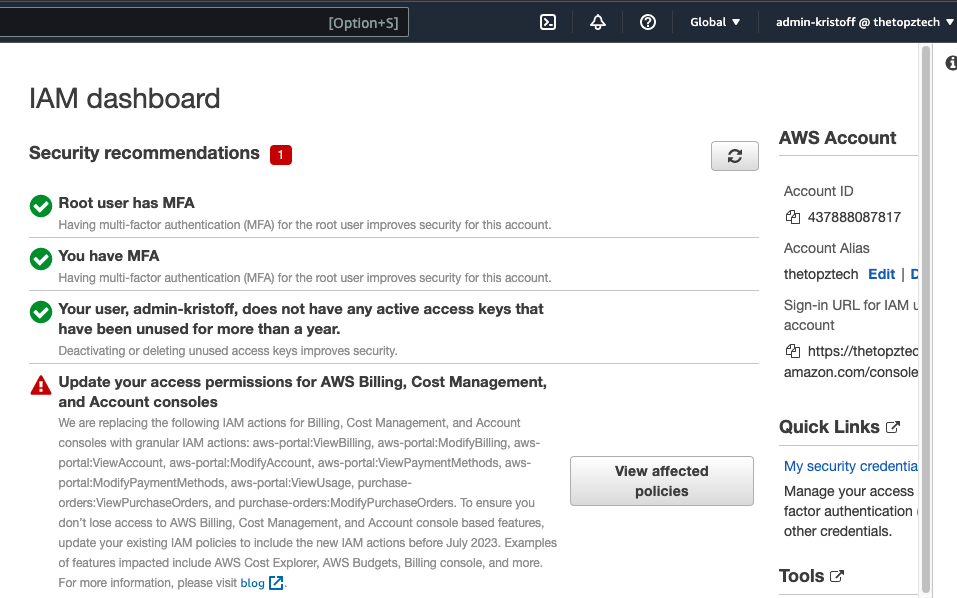

# Week 0 — Billing and Architecture

## Required Homework

### 1. Watched, and followed along where possible,the following videos:
- Week 0 - Live Streamed Video
- Chirag's Week 0 - Spend Considerations
- Ashish's Week 0 - Security Considerations
  

Learnings from the videos:
- The topics discussed in the live stream set the tone for the whole project and was essential in keeping everyone in the same page.
- Chirag's discussion on spend considerations are very important most especially on setting billing alarm and budgets so that one can get notified of spend and not get any surprises later on. AWS has plenty of tools to support this and one just have to make use wisely.
- From Ashish's discussion, I learned that an organization doesn't have to configure all security measures on day 1. Rather, the organization needs to know the business requirements and go from there.
- It is always necessary to set up an admin user/group as an IAM user to manage an organization's resources, and use it instead of the root account. The root account should never be used in operations purposes, or better not use it at all. Once the root account is compromised, it is like the end of the world for you!
   
<br>

### 2. Created an Admin User


<br>

Also, configured MFA for this admin user:



### 3. Used CloudShell
Executed the command for auto-prompt and used cloud shell to verify the user's identity.
```console
aws --cli-auto-prompt 
```


<br> 

### 4. Generate AWS Credentials

I generated AWS credentials (to access CLI) for my created admin user as per #2 above. I took note of the access key and secret access key, as well as downloaded the CSV with credentials.

<br>

### 5. Installed AWS CLI
I followed along Andrew Brown's instruction on manually installing AWS CLI in Gitpod, particularly:
- downloaded aws cli installer in /workspace folder, unzip the file and install it by executing each of the commands:
    ```console
    curl "https://awscli.amazonaws.com/awscli-exe-linux-x86_64.zip" -o "awscliv2.zip"
    unzip awscliv2.zip
    sudo ./aws/install
    ```
- stored generated credentials from #4 in active bash terminal:
    ```console
    export AWS_ACCESS_KEY_ID="XXXXXXXXXXXXXXX"
    export AWS_SECRET_ACCESS_KEY="XXXXXXXXXXXXXXXXXXXXXXXXXXX"
    export AWS_DEFAULT_REGION=us-east-1
    ```
- Checked if it is working using command:
  ```console
  aws sts get-caller-identity
  ```

- and I get:
- 

Moreover, to perform the above steps every time gitpod launches, I set up the [gitpod.yml](../.gitpod.yml) file as per instruction.

<br> 

### 6. Created a Billing Alarm

I created a billing alarm through CLI:

- Firstly, created SNS topic, created a subscription and confirmed the subscription in email:

    ```console
    aws sns create-topic --name billing-alarm
    ```

    ```console
    aws sns subscribe \
    --topic-arn ="arn:aws:sns:us-east-1:437888087817:billing-alarm" \
    --protocol=email \
    --notification-endpoint=kxxxxxxxxxxz@outlook.com
    ```
- Secondly, updated the [alarm-config.json ](../aws/json/alarm-config.json) with the topic ARN.
- Lastly, executed the aws cloudwatch command:

    ```console
    aws cloudwatch put-metric-alarm --cli-input-json file://aws/json/alarm_config.json
    ```
Screenshot of billing alarm created:
<br>

Also, I tried creating billing alarm through console utilizing the same SNS topic created above:


### 7. Created a Budget
a. Using the budget definition in [budget.json](../aws/json/budget.json), I created a budget through CLI using the code below. One of my key takeaways is that every time this code is executed, a budget is created. Hence, one must be mindful to do so as having more than 2 budgets will incur costs.

```console
aws budgets create-budget \
    --account-id 437888087817 \
    --budget file://aws/json/budget.json \
    --notifications-with-subscribers file://aws/json/budget-notifications-with-subscribers.json
```

Screenshot of budget created:

<br>

### 8. Recreated Conceptual Diagram on a Napkin
Screenshot: 


### 9.  Recreated Logical Architectural Diagram in Lucid Charts
[Lucid chart reference](https://lucid.app/lucidchart/33b84672-6db5-4857-a377-cc9f1eb8d5f0/edit?viewport_loc=470%2C212%2C2036%2C1662%2C0_0&invitationId=inv_55e02421-1786-4a48-b8f6-db99d38de38c)

Screenshot: 


## Homework Challenges

### . Created an architectural diagram (to the best of my ability and with reference) the CI/CD logical pipeline in Lucid Charts

[Lucid chart link](https://lucid.app/lucidchart/036b7207-6f33-4805-b5d8-b7144ba6e3cb/edit?viewport_loc=-446%2C-220%2C2462%2C1359%2C0_0&invitationId=inv_70da2b67-dde4-4fe9-8390-c74c389abfe1)

Screenshot:


Reference: [Complete CI/CD with AWS CodeCommit, AWS CodeBuild, AWS CodeDeploy, and AWS CodePipeline](https://aws.amazon.com/blogs/devops/complete-ci-cd-with-aws-codecommit-aws-codebuild-aws-codedeploy-and-aws-codepipeline/)

<br>

### 2. Used EventBridge to hookup Health Dashboard to SNS and send notification when there is a service health issue.
Summary of configuration:


<br>

### 3. Destroyed my root account credentials, Set MFA, IAM role
- Destroyed root account credentials by deactivating access key first, then delete:
  
  - Deactivate:
  - 
  - Delete:
  - 

- Set MFA for added layer of security for the root account
  

- Set IAM role to be used by IAM user or group
  

### 4. Reviewed all the questions of each pillars in the Well Architected Tool (No specialized lens)
[Link to Report](assets/Cruddur_wellarchitected.pdf)

### 5. Explored on how to open a support ticket and request a service limit
I did not really opened a support ticket to request service limit, but just get familiarized on where to navigate for this.

[Link to the site](https://support.console.aws.amazon.com/support/home#/case/create?issueType=service-limit-increase)

Screenshot:


### 6. Researched the technical and service limits of specific services and how they could impact the technical path for technical flexibility. 

I just looked for the document to include service quotas of all services. 
[Link to the site](https://docs.aws.amazon.com/pdfs/general/latest/gr/aws-general.pdf#aws-service-information)

As far as the impact on technical path for technical flexibility, I'm not really sure at the moment.  But from the top of my head, it might be, for example, in the list below for "Attachments per VPC" which has a quota of 5. If the workload requires more, we'd have to design the architecture within that limit or else we'd request for an increase in the quota and justify to AWS.

