# Week 1 — App Containerization

## Required Homework

### I watched all of the videos for the week:
- My key takeaway from Chirag's spending considerations is that for GitPod, need to ensure that there are no concurrent workspaces running as the consumption aggregates, hence the cost aggregates as well. One needs to explicitly stop the workspace when not anymore in use even if the workspace will be deleted after 30 minutes of idle time.
- My key takeaway from Ashish's Container security considerations is that it is recommended to utilize existing tools like Snyk to ensure containers are secure and have no vulnerabilities.
- Alongside with the instructions that Andrew has demonstrated in GitPod, I was also doing it in my local machine as part of the stretch homework below.

<br>

After following through the videos about "live stream", "OpenAI document", "Write Flask Backend Enpoint for Notifications" and "Write a React Page for Notifications" and referring to [Andrew Brown's week 1 instructions](https://github.com/omenking/aws-bootcamp-cruddur-2023/blob/week-1/journal/week1.md), I was able to set up run front-end and back-end containers simultaneously and linked them together through docker-compose file.  I was also able to add in the Notifications feature. The final working results are shown below screenshot:

<br>

### Frontend

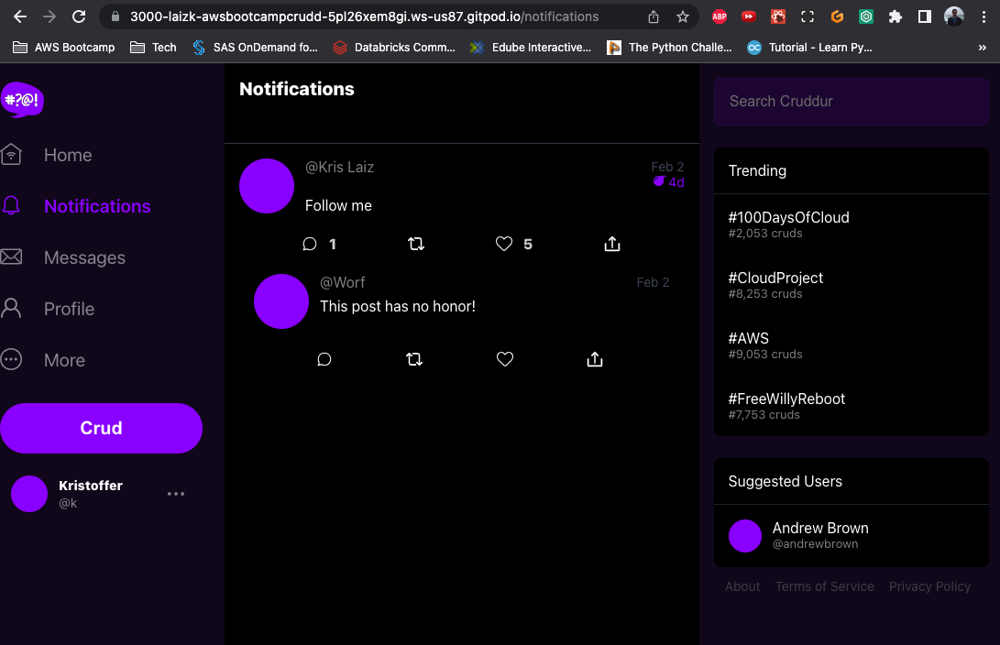


### Backend

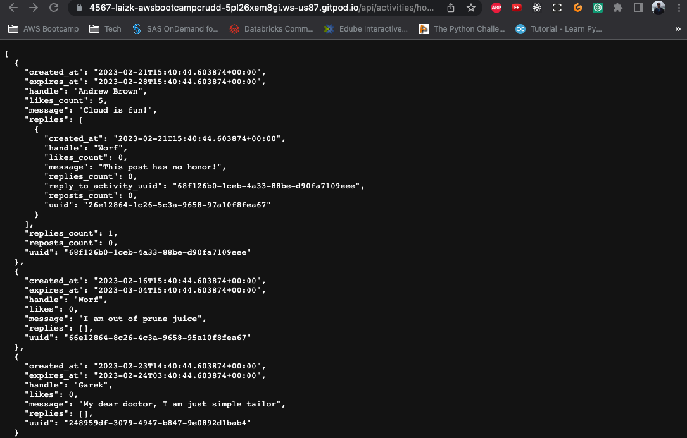

<br>

Below is a summary of steps I took to achieve the above final results:
1. For frontend, I ensured to run `npm install` within the frontend-react-js so the frontend container needs to copy the contents of node_module folder. To automatically achieve this when gitpod is launched, I modified [gitpod.yml](../.gitpod.yml) to include below:
   
   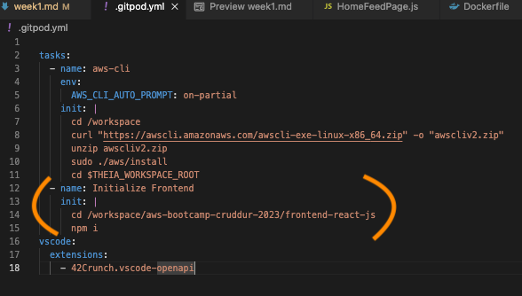

2. Created [Dockerfile](../frontend-react-js/Dockerfile) at frontend
3. Created [Dockerfile](../backend-flask/Dockerfile) at backend
4. For the above, ensure that the Dockerfiles are in the correct directories
5. Create [docker-compose.yml](../docker-compose.yml) to orchestrate running the frontend and backend containers.
6. Performed `compose up` over the docker-compose.yml file to start running the containers.
   
    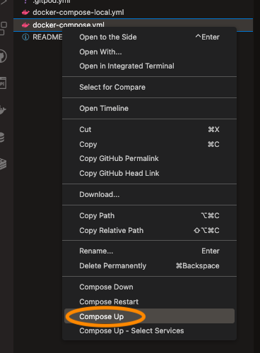

    or run the code:

    ```sh
    docker-compose up
    ```

    or 

    ```sh
    docker compose up
    ```

7. When the run was done, I ensured to make the ports are running successfully and make them public
   
   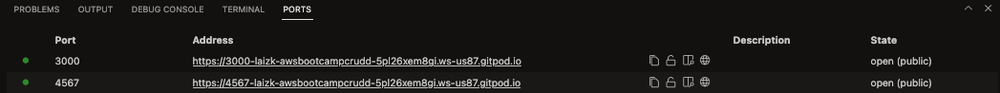

8. Verified that both backend and frontend components are working.
9. At backend, I appended `/api/activies/home` to the url and esure that a message in JSON format is returned.
10. At frontend, I ensured to see all elements of the Cruddur app. User will need to sign up and sign in to see the full features.
11. To add notifications, I added/modified the following scripts as per instructions:
    1.  Frontend:  
        1.  [NotificationsFeedPage.css](../frontend-react-js/src/pages/NotificationsFeedPage.css) - to cover any CSS styles similar to Home page.
        2.  [NotificationsFeedPage.js](../frontend-react-js/src/pages/NotificationsFeedPage.js) - to provide the actual React component for notifications.
        3.  [App.js](../frontend-react-js/src/App.js) - to include the Notifications component into the App
    
    2.  Backend:
        1.  [notifications_activities.py](../backend-flask/services/notifications_activities.py) - to facilitate the logic for notifications activities at the backend including the data
        2.  [app.py](../backend-flask/app.py) - to add the notifications_activities service into the application
        3.  [openapi-3.0.yml](../backend-flask/openapi-3.0.yml) - to add the notifications_activities service into the API service. At this point, I learned more about [OpenAPI](https://swagger.io/specification/#oas-components).

12. Changes were reflected in the applications.

<br>

### For the above, there are important docker commands I noted:

Build Container

```
docker build -t  backend-flask ./backend-flask
```

Run Container

```
docker run --rm -p 4567:4567 -it -e FRONTEND_URL='*' -e BACKEND_URL='*' backend-flask
```

Get Container Images or Running Container Ids
```
docker ps
docker images
```

Gain Access to a Container
```
docker exec CONTAINER_ID -it /bin/bash
```

Delete an Image
```
docker image rm backend-flask --force
```

<br>

### Ran DynamoDB Local Container and ensured it worked

I first incorporated the follow code into the [gitpod.yml](../.gitpod.yml) file:

```yml
services:
  dynamodb-local:
    # https://stackoverflow.com/questions/67533058/persist-local-dynamodb-data-in-volumes-lack-permission-unable-to-open-databa
    # We needed to add user:root to get this working.
    user: root
    command: "-jar DynamoDBLocal.jar -sharedDb -dbPath ./data"
    image: "amazon/dynamodb-local:latest"
    container_name: dynamodb-local
    ports:
      - "8000:8000"
    volumes:
      - "./docker/dynamodb:/home/dynamodblocal/data"
    working_dir: /home/dynamodblocal
```

Then, I followed the steps indicated in the [100 Days of Cloud](https://github.com/100DaysOfCloud/challenge-dynamodb-local) challenge by Andrew Brown:

### Result screenshot:

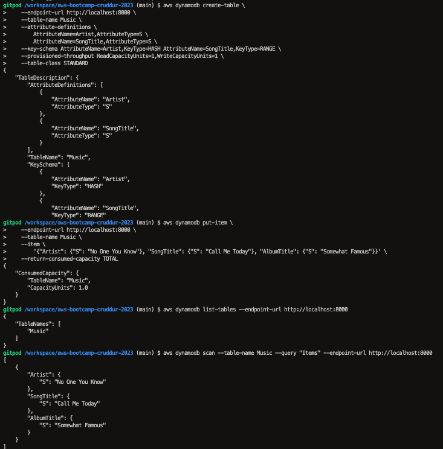


<br>

### Ran Postgres Container and ensured it worked
I first incorporated the follow code into the [gitpod.yml](../.gitpod.yml) file:

```yml
services:
  db:
    image: postgres:13-alpine
    restart: always
    environment:
      - POSTGRES_USER=postgres
      - POSTGRES_PASSWORD=password
    ports:
      - '5432:5432'
    volumes: 
      - db:/var/lib/postgresql/data
volumes:
  db:
    driver: local
```

and

```yml
  - name: postgres
    init: |
      curl -fsSL https://www.postgresql.org/media/keys/ACCC4CF8.asc|sudo gpg --dearmor -o /etc/apt/trusted.gpg.d/postgresql.gpg
      echo "deb http://apt.postgresql.org/pub/repos/apt/ `lsb_release -cs`-pgdg main" |sudo tee  /etc/apt/sources.list.d/pgdg.list
      sudo apt update
      sudo apt install -y postgresql-client-13 libpq-dev
```

I was able to verify successful connection through:

### Database Explorer extension
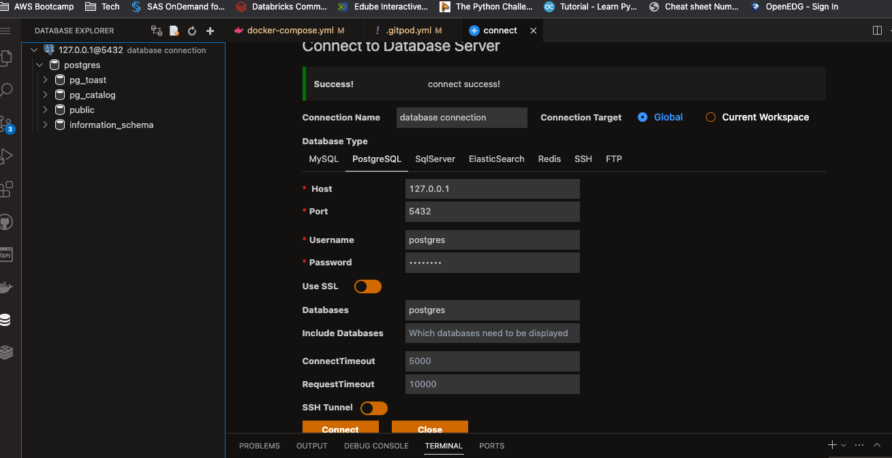

### CLI

Using command:

```
psql -U postgres -h localhost
```

Screenshots:

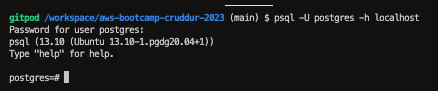
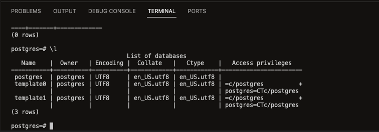

<br>

## Homework Challenges

### Learned how to install Docker on my localmachine and get the same containers running outside of Gitpod / Codespaces
I installed Docker Desktop for Mac
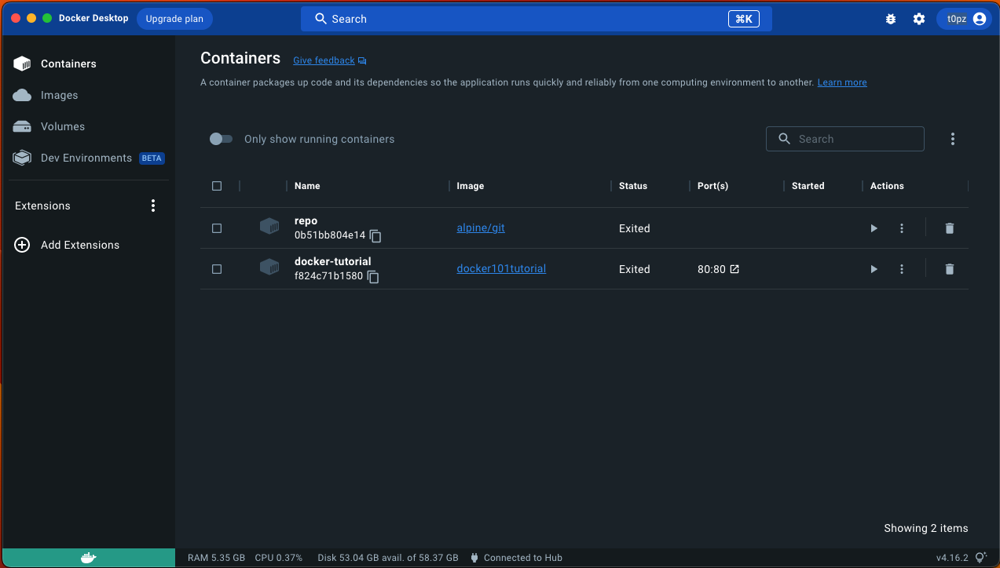

I ran the same Dockerfile as was with the live stream
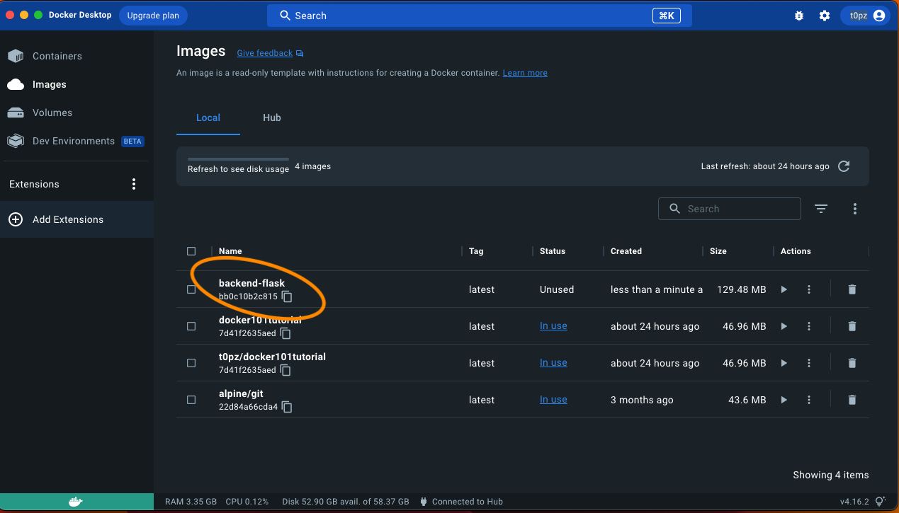

c. However, I noticed a difference. In local, only 5 layers were processed until "COPY . ." command. The rest did not show up.
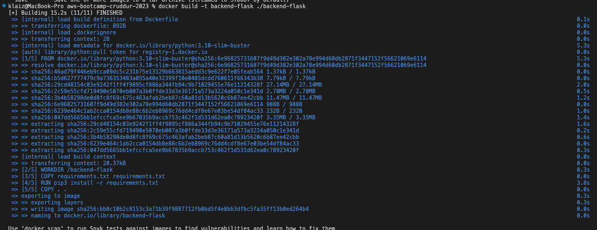

d. I was able to successfully deploy backend-flask app locally, using the command:

```
docker run --rm -p 4567:4567 -it -e FRONTEND_URL='*' -e BACKEND_URL='*' backend-flask 
```

Screenshot:
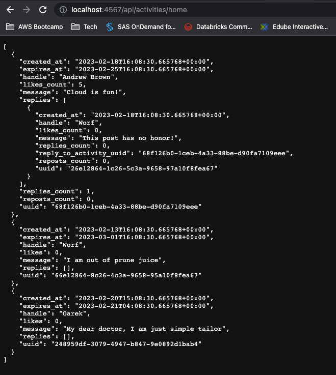


In the attempt to deploy the app locally, I created a :[docker-compose-local.yml](../docker-compose-local.yml)

I experienced an issue with using https for both FRONTEND_URL and BACKEND_URL. I search workaround in the internet and the one that worked for me is to change https to http. Not secure but anyway, this is local.

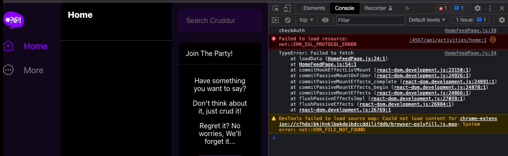


After the https -> http fix, I was able to successfully deploy frontend app using docker-compose.yml file from localhost and implemented the notifications changes locally:

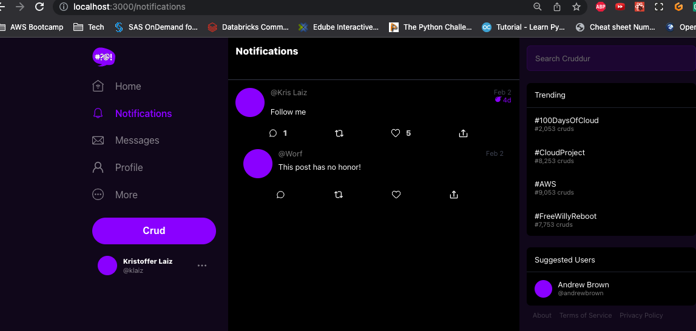

I also was able to successfully setup dynamodb and postgres:

DynamoDB:

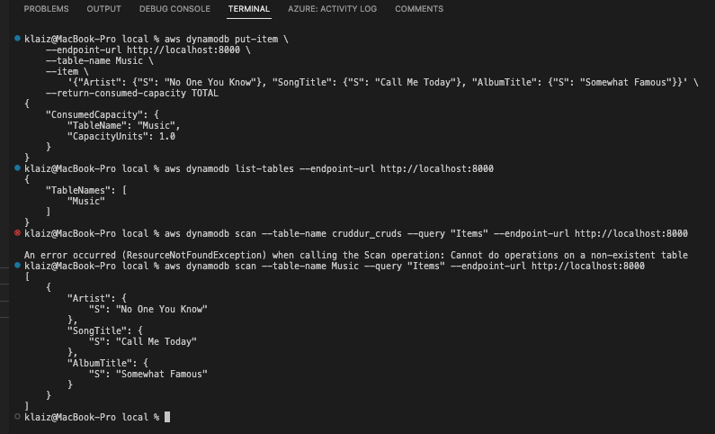


Postgres:

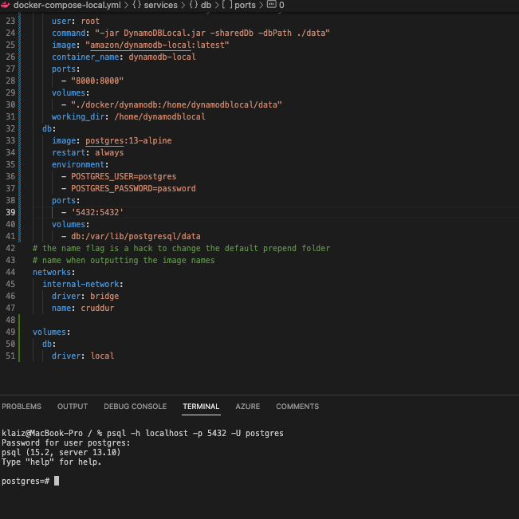


*** However, there were pre-requisites I needed to do:
1. For Dynamodb tests, I installed AWS cli to my local machine by following the instructions in this [link](https://docs.aws.amazon.com/cli/latest/userguide/getting-started-install.html).
2. For Postgres, I installed postgres to my local machine by following the instructions in this [link](https://www.timescale.com/blog/how-to-install-psql-on-mac-ubuntu-debian-windows/)


<br>

### 2. Pushed and tagged a image to DockerHub (they have a free tier)

I used the following commands to push image to DockerHub:

```
docker tag backend-flask t0pz/aws-bootcamp-cruddur-2023-backend_flask:v1.0.0
docker push t0pz/aws-bootcamp-cruddur-2023-backend_flask:v1.0.0
```

CLI terminal screenshot:


Dockerhub screenshot:

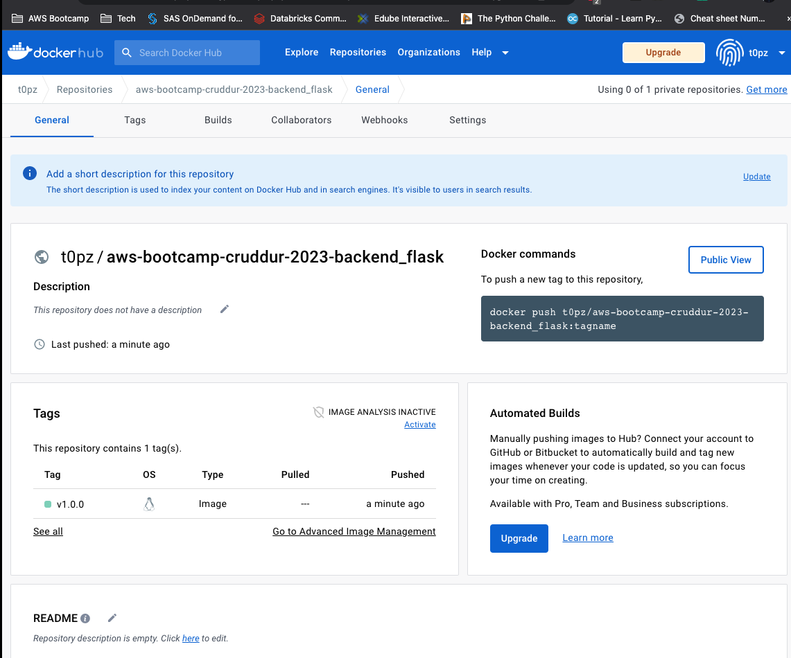

