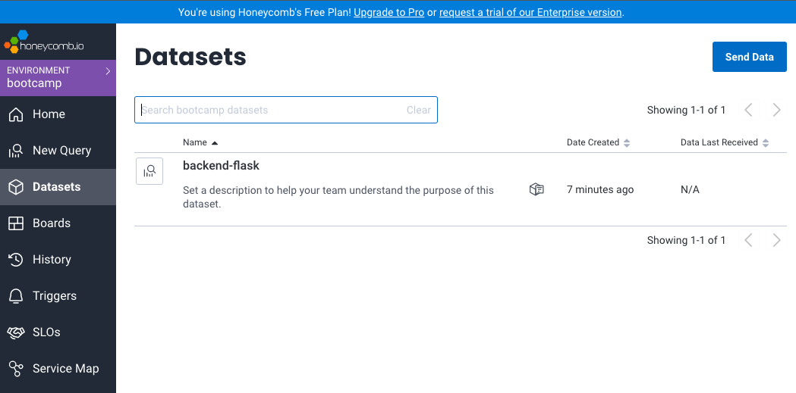
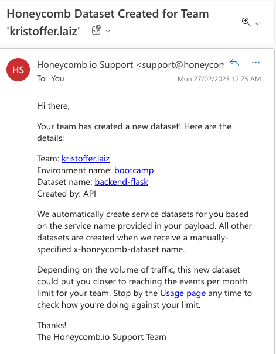
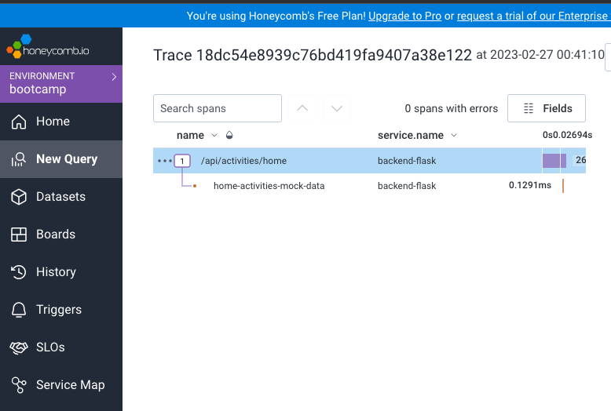
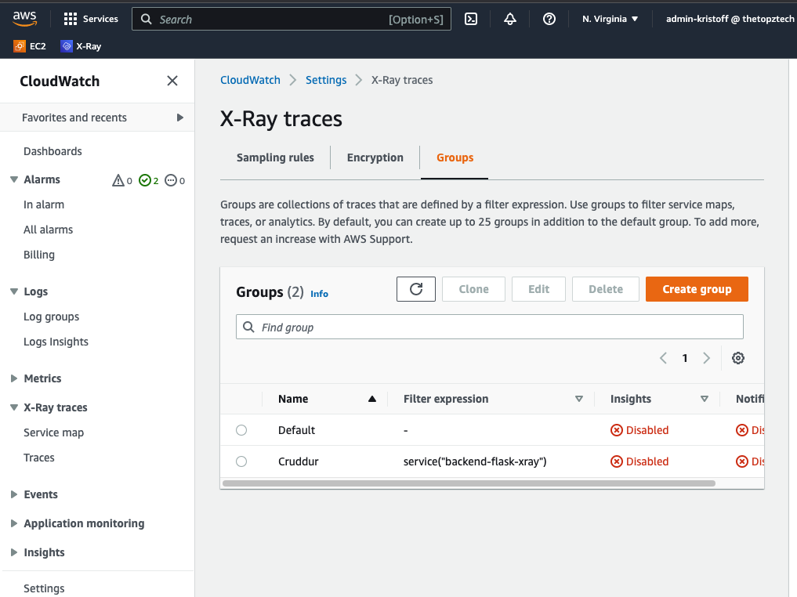
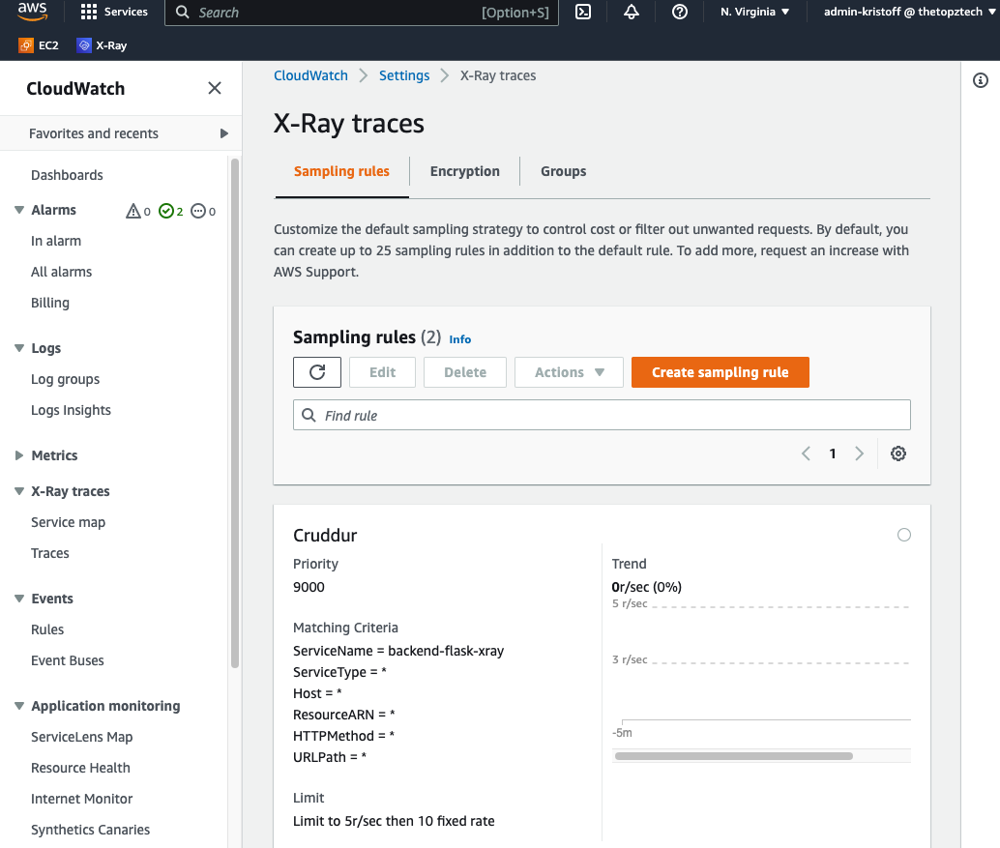
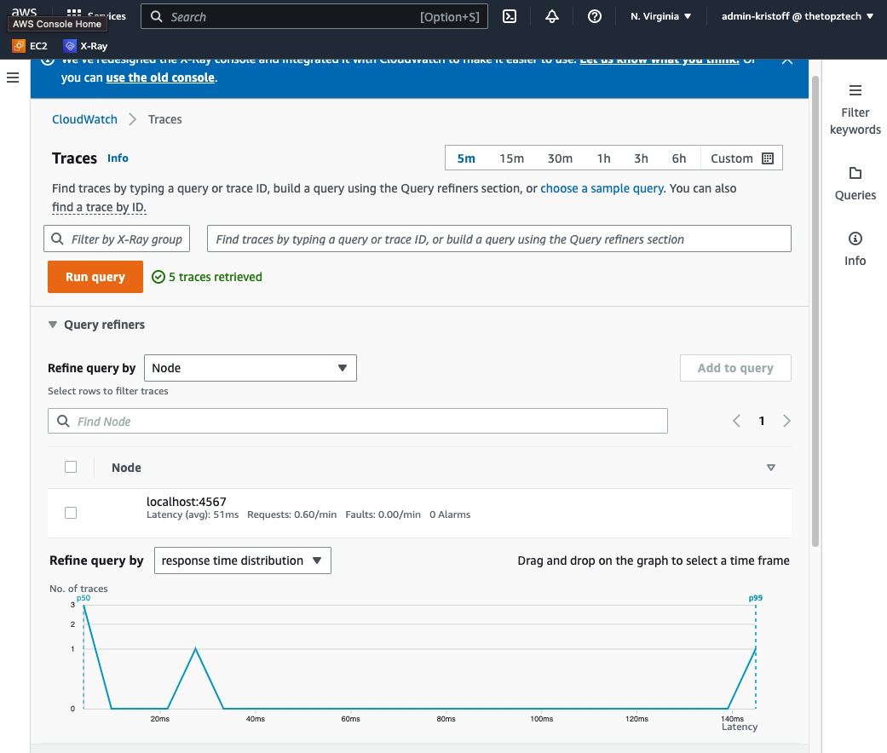
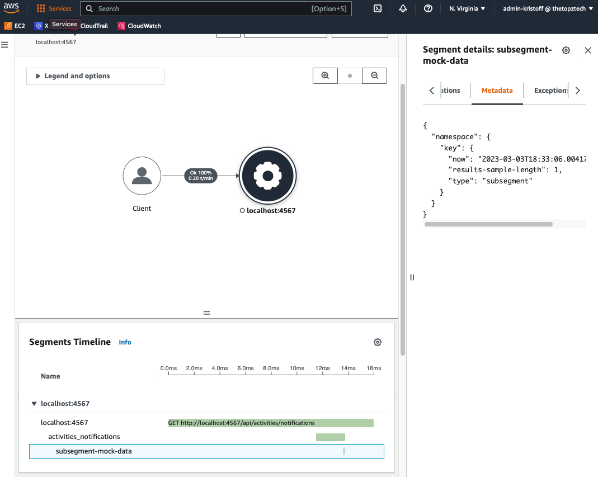
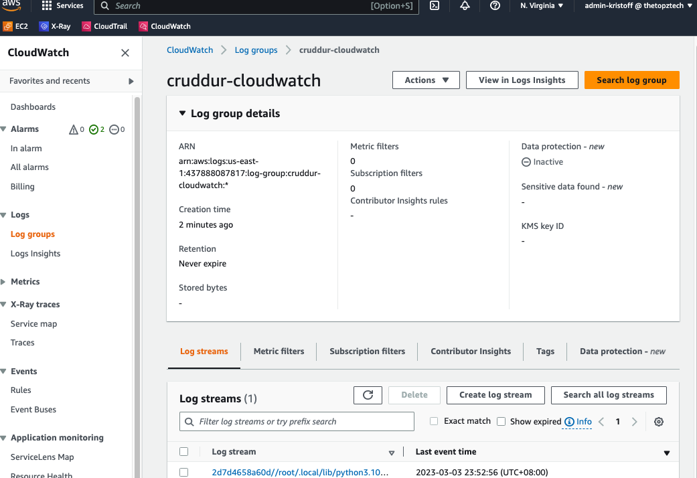
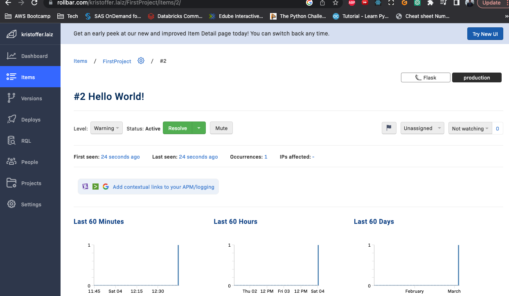
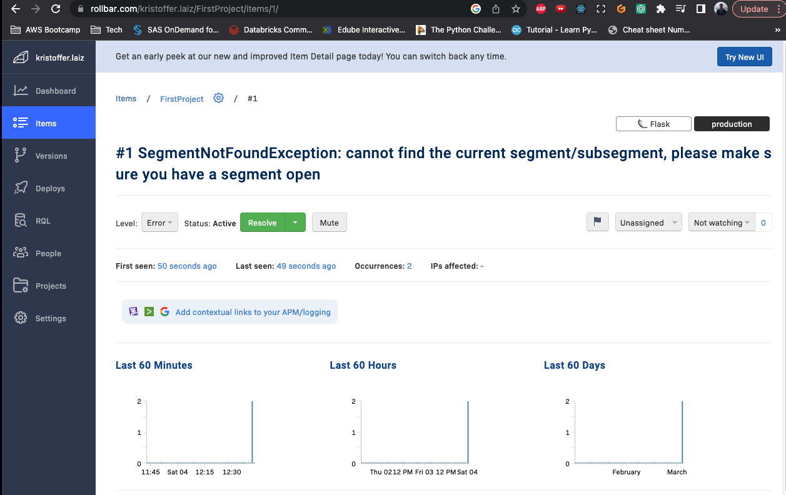

# Week 2 — Distributed Tracing

## Required Homework

For all required homework, I followed along exactly (except that I did it in my local machine first, to save credits, then tested using GitPod) what Andrew has demonstration in the instructional videos and referring to the branch:
https://github.com/omenking/aws-bootcamp-cruddur-2023/blob/week-2/journal/week2.md. 

The only difference is that I was also maintaining [docker-compose-local.yml](../docker-compose-local.yml) to run specifically in my local. Other than these, all steps are identical. Hence, I will not be repeating the same steps here but will show screenshots of my results.

### Telemetry

I setup honeycomb instrumentation in my local. Honeycomb received my data:

I also received email from Honeycomb.io Support that a new dataset is created with the details.

After setting a 'mock-data' span, I was able to see it in honeycomb:

I was able to add app.now and app.result_length and see this in honeycomb

### X-RAY

I was able to create the xray group

I was also able to create the sampling rule

I was able to make X-ray work

I was able to create custom subsegment. This one is a bit different as I did this in the [notifications_activities.py](../backend-flask/services/notifications_activities.py).

### CLOUDWATCH

I was able to configure cloudwatch at backend, and successfully sent logs in AWS Console

### ROLLBAR

I was able to configure rollbar with test Hello World and with an error

Hello world!

With error (this is due to me still working on the x-ray segment/subsegment which caused error in notification page)

