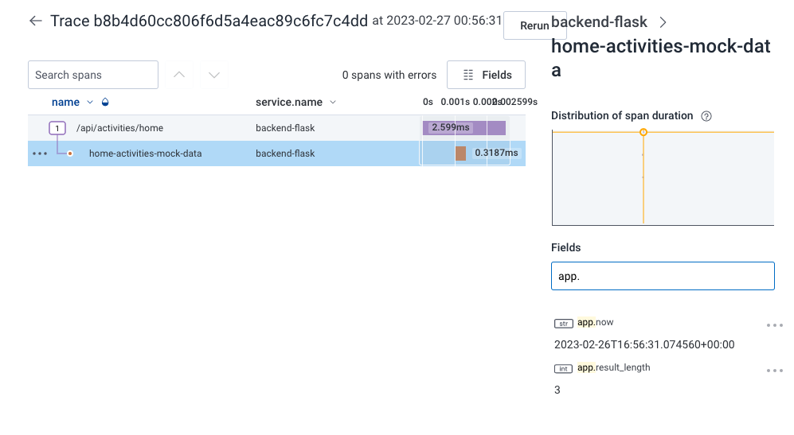

# Week 2 — Distributed Tracing

## Required Homework

For all required homework, I followed along exactly (except that I did it in my local machine first, to save credits, then tested using GitPod) what Andrew has demonstration in the instructional videos and referring to the branch:
https://github.com/omenking/aws-bootcamp-cruddur-2023/blob/week-2/journal/week2.md. 

For my local machine, I am maintaining a separate docker composer file, [docker-compose-local.yml](../docker-compose-local.yml) for the reason of having different `FRONTEND_URL` and `BACKEND_URL` for localmachine vs GitPod. These variables can be stored in an `.env` file but I chose not to do so for easy checking of `docker-compose.yml `file having GitPod-specific variables.


For week 2, we focused on different methods on implementing observability of distributed services.  Here we touched on applications such as Honeycomb, AWS X-ray, AWS CloudWatch and Rollbar.

### Honeycomb

"Honeycomb helps you analyze your data to discover issues buried deep within your stack. Slow is the new down. Honeycomb is designed to help teams make smart investments in optimizing performance for better user experiences."

[Learn more about Honeycomb](https://www.honeycomb.io/)

These are the steps how I configured honeycomb to integrate with the Cruddur application at backend:

Firstly, I added the following modules to [requirements.txt](../backend-flask/requirements.txt)

```
opentelemetry-api 
opentelemetry-sdk 
opentelemetry-exporter-otlp-proto-http 
opentelemetry-instrumentation-flask 
opentelemetry-instrumentation-requests
We'll install these dependencies:
```

and installed these using:

```
pip install -r requirements.txt
```

I added the following code blocks to `app.py':

Import required modules

```python
from opentelemetry import trace
from opentelemetry.instrumentation.flask import FlaskInstrumentor
from opentelemetry.instrumentation.requests import RequestsInstrumentor
from opentelemetry.exporter.otlp.proto.http.trace_exporter import OTLPSpanExporter
from opentelemetry.sdk.trace import TracerProvider
from opentelemetry.sdk.trace.export import BatchSpanProcessor
```

Initialize tracing and an exporter that can send data to Honeycomb
```python
provider = TracerProvider()
processor = BatchSpanProcessor(OTLPSpanExporter())
provider.add_span_processor(processor)
trace.set_tracer_provider(provider)
tracer = trace.get_tracer(__name__)
```

Initialize automatic instrumentation with Flask

```python
app = Flask(__name__)
FlaskInstrumentor().instrument_app(app)
RequestsInstrumentor().instrument()
```

I retrieved my `HONEYCOMB_API_KEY` value from my honeycomb account. 


In my local, I stored this in an .env file 

For GitPod, I executed the following commands to set this up:

```
export HONEYCOMB_API_KEY=<key>
```

```
gp env HONEYCOMB_API_KEY=<key>
```

I added the following environment variables to `backend-flask` in my docker compose files:
```
OTEL_SERVICE_NAME: "backend-flask"
OTEL_EXPORTER_OTLP_ENDPOINT: "https://api.honeycomb.io"
OTEL_EXPORTER_OTLP_HEADERS: "x-honeycomb-team=${HONEYCOMB_API_KEY}"
OTEL_SERVICE_NAME: "${HONEYCOMB_SERVICE_NAME}"
```

After all of these, composed up and navigated through the front-end, I was able to successfully send telemetry data to Honeycomb:


I also received email from Honeycomb.io Support that a new dataset is created with the details.


After setting a 'mock-data' span in [home_activities.py](../backend-flask/services/home_activities.py), I was able to see it in honeycomb:


I was able to add app.now and app.result_length and see this in honeycomb




### X-RAY

"AWS X-Ray provides a complete view of requests as they travel through your application and filters visual data across payloads, functions, traces, services, APIs, and more with no-code and low-code motions."

[Learn more about AWS X-Ray](https://aws.amazon.com/xray/)

These are the steps I did to integrate AWS X-ray into the Cruddur application:

Firstly, I added `aws-xray-sdk` module into the `requirements.txt`, then installed modules and dependencies using the command:

```
pip install -r requirements.txt
```

I added the following into `app.py`:

```python
from aws_xray_sdk.core import xray_recorder
from aws_xray_sdk.ext.flask.middleware import XRayMiddleware

xray_url = os.getenv("AWS_XRAY_URL")
xray_recorder.configure(service='backend-flask-xray', dynamic_naming=xray_url)
XRayMiddleware(app, xray_recorder)
```

In Gitpod, I ensure that this is in the environment variables:

```
export AWS_REGION="us-east-1"
gp env AWS_REGION="us-east-1"
```

In local, I stored this in an `.env` file:

```
AWS_REGION="us-east-1"
```

In docker compose file, I added the following code blocks:

To set Env Vars, for docker-composer-local.yml:
```
AWS_XRAY_URL: "*localhost:4567*"
AWS_XRAY_DAEMON_ADDRESS: "xray-daemon:2000"
```

To set Env Vars, for docker-composer.yml:

```
AWS_XRAY_URL: "*4567-${GITPOD_WORKSPACE_ID}.${GITPOD_WORKSPACE_CLUSTER_HOST}*"
AWS_XRAY_DAEMON_ADDRESS: "xray-daemon:2000"
```

To install xray-daemon when the container is run:
```
  xray-daemon:
    image: "amazon/aws-xray-daemon"
    environment:
      AWS_ACCESS_KEY_ID: "${AWS_ACCESS_KEY_ID}"
      AWS_SECRET_ACCESS_KEY: "${AWS_SECRET_ACCESS_KEY}"
      AWS_REGION: "us-east-1"
    command:
      - "xray -o -b xray-daemon:2000"
    ports:
      - 2000:2000/udp
```

I set up AWS X-ray resources.

- Added [aws/json/xray.json](../aws/json/xray.json).
- Created AWS x-ray group
  - For my local machine:
    ```
    FLASK_ADDRESS="https//localhost:4567"
    aws xray create-group \
    --group-name "Cruddur" \
    --filter-expression "service(\"$FLASK_ADDRESS\")"
    ```

  - For Gitpod
    ```
    FLASK_ADDRESS="https://4567-${GITPOD_WORKSPACE_ID}.${GITPOD_WORKSPACE_CLUSTER_HOST}"
    aws xray create-group \
    --group-name "Cruddur" \
    --filter-expression "service(\"$FLASK_ADDRESS\")"
    ```

- Created sampling rule
  ```
  aws xray create-sampling-rule --cli-input-json file://aws/json/xray.json
  ```

Below are the results after the configuration. These are done through local machine.

I was able to create the xray group


I was also able to create the sampling rule


I was able to make X-ray work


I was able to create custom subsegment. This one is a bit different as I did this in the [notifications_activities.py](../backend-flask/services/notifications_activities.py).


Below screenshot shows that I was also able to successfully configure everything when the application is deployed in Gitpod:


### CLOUDWATCH

"Amazon CloudWatch collects and visualizes real-time logs, metrics, and event data in automated dashboards to streamline your infrastructure and application maintenance."

[Learn more about CloudWatch](https://aws.amazon.com/cloudwatch/)

These are the steps I did to integrate CloudWatch into the Cruddur application.

Firstly, I added `watchtower` module into the `requirements.txt`, then installed modules and dependencies using the command:

```
pip install -r requirements.txt
```

I added the following into `app.py`:

Import dependencies
```python
import watchtower
import logging
from time import strftime
```

Configured Logger to Use CloudWatch
```python
LOGGER = logging.getLogger(__name__)
LOGGER.setLevel(logging.DEBUG)
console_handler = logging.StreamHandler()
cw_handler = watchtower.CloudWatchLogHandler(log_group='cruddur-cloudwatch')
LOGGER.addHandler(console_handler)
LOGGER.addHandler(cw_handler)
LOGGER.info("test log")
```

```python
@app.after_request
def after_request(response):
    timestamp = strftime('[%Y-%b-%d %H:%M]')
    LOGGER.error('%s %s %s %s %s %s', timestamp, request.remote_addr, request.method, request.scheme, request.full_path, response.status)
    return response
```

Configured env vars in backend-flask for `docker-composer.yml`:

```
AWS_DEFAULT_REGION: "${AWS_DEFAULT_REGION}"
AWS_ACCESS_KEY_ID: "${AWS_ACCESS_KEY_ID}"
AWS_SECRET_ACCESS_KEY: "${AWS_SECRET_ACCESS_KEY}"
```

I was able to configure cloudwatch at backend, and successfully sent logs in AWS Console


### ROLLBAR

"Rollbar is a cloud-based bug tracking and monitoring solution that caters to organizations of all sizes."

Learn more about Rollbar](https://rollbar.com)

These are the steps I did to integrate Rollbar into the Cruddur application:

Firstly, I created a new project in Rollbar, noting the access token to be stored into env var `ROLLBAR_ACCESS_TOKEN` later on.

I added the following module sinto the `requirements.txt`:
```
blinker
rollbar
```

Then installed modules and dependencies using the command:

```
pip install -r requirements.txt
```

In Gitpod, I set up the access token taken from Rollbar while creating the project:
```
export ROLLBAR_ACCESS_TOKEN=<access token from rollbar>
gp env ROLLBAR_ACCESS_TOKEN=<access token from rollbar>
```

In local machine, I stored this in an `.env` file:

```
ROLLBAR_ACCESS_TOKEN=<access token from rollbar>
```

I added the following into `app.py`:

Imported dependencies for rollbar
```python
import rollbar
import rollbar.contrib.flask
from flask import got_request_exception
```

```python
rollbar_access_token = os.getenv('ROLLBAR_ACCESS_TOKEN')
@app.before_first_request
def init_rollbar():
    """init rollbar module"""
    rollbar.init(
        # access token
        rollbar_access_token,
        # environment name
        'production',
        # server root directory, makes tracebacks prettier
        root=os.path.dirname(os.path.realpath(__file__)),
        # flask already sets up logging
        allow_logging_basic_config=False)

    # send exceptions from `app` to rollbar, using flask's signal system.
    got_request_exception.connect(rollbar.contrib.flask.report_exception, app)
```

Added an enpoint just for testing rollbar to `app.py`:

```python
@app.route('/rollbar/test')
def rollbar_test():
    rollbar.report_message('Hello World!', 'warning')
    return "Hello World!"
```

I was able to configure rollbar with test Hello World and with an error:

Hello world!


With error (this is due to me still working on the x-ray segment/subsegment which caused error in notification page)


## Homework Challenges

### Instrument Honeycomb for the frontend-application to observe network latency between frontend and backend[HARD]
### Add custom instrumentation to Honeycomb to add more attributes eg. UserId, Add a custom span
### Run custom queries in Honeycomb and save them later eg. Latency by UserID, Recent Traces
