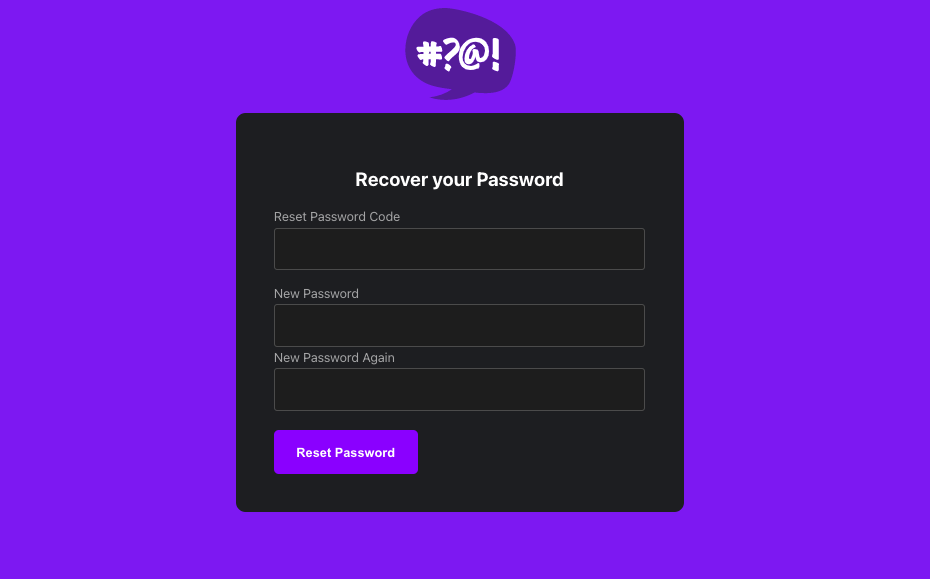

# Week 3 — Decentralized Authentication

## Required Homework

I completed all items in Todo checklist, except for Chirag's video for week 3 - spending considerations as it was not available.

- Watched Ashish's Week 3 
- Setup Cognito User Pool	
- Implement Custom Signin Page
- Implement Custom Signup Page
- Implement Custom Confirmation Page
- Implement Custom Recovery Page
- Watch about different approaches to verifying JWTs

It has been pretty busier work week for me than last week, but here I am very eager to complete at least the required homework which I did as per below. :)

## Provision via ClickOps a Amazon Cognito User Pool

Following through [Andrew's video](https://www.youtube.com/watch?v=9obl7rVgzJw&list=PLBfufR7vyJJ7k25byhRXJldB5AiwgNnWv&index=40), I created a user pool.


## Install and configure Amplify client-side library for Amazon Congito

I installed AWS Amplify by using the command:

```
npm i aws-amplify --save
```
"--save" adds the module to package.json.

In [App.js](../frontend-react-js/src/App.js), I added the following code to link up the configured Cognito user pool:

```javascript
import { Amplify } from 'aws-amplify';

Amplify.configure({
  "AWS_PROJECT_REGION": process.env.REACT_APP_AWS_PROJECT_REGION,
  "aws_cognito_identity_pool_id": process.env.REACT_APP_AWS_COGNITO_IDENTITY_POOL_ID,
  "aws_cognito_region": process.env.REACT_APP_AWS_COGNITO_REGION,
  "aws_user_pools_id": process.env.REACT_APP_AWS_USER_POOLS_ID,
  "aws_user_pools_web_client_id": process.env.REACT_APP_CLIENT_ID,
  "oauth": {},
  Auth: {
    // We are not using an Identity Pool
    // identityPoolId: process.env.REACT_APP_IDENTITY_POOL_ID, // REQUIRED - Amazon Cognito Identity Pool ID
    region: process.env.REACT_APP_AWS_PROJECT_REGION,           // REQUIRED - Amazon Cognito Region
    userPoolId: process.env.REACT_APP_AWS_USER_POOLS_ID,         // OPTIONAL - Amazon Cognito User Pool ID
    userPoolWebClientId: process.env.REACT_APP_CLIENT_ID,   // OPTIONAL - Amazon Cognito Web Client ID (26-char alphanumeric string)
  }
})
```

As noticed, there are new environment variables as values passed to the object parameter to the Amplify configure function. These environment variables are setup in [docker-compose.yml](../docker-compose.yml).

Also, using a manually created user in Cognito user pool, there was an access token error when logging in as that user to the Cruddur app.

To solve this, the 'checkAuth' function in [HomeFeedPage.js](../frontend-react-js/src/pages/HomeFeedPage.js) is updated as below:

```javascript
// check if we are authenicated
const checkAuth = async () => {
  Auth.currentAuthenticatedUser({
    // Optional, By default is false. 
    // If set to true, this call will send a 
    // request to Cognito to get the latest user data
    bypassCache: false 
  })
  .then((user) => {
    console.log('user',user);
    return Auth.currentAuthenticatedUser()
  }).then((cognito_user) => {
      setUser({
        display_name: cognito_user.attributes.name,
        handle: cognito_user.attributes.preferred_username
      })
  })
  .catch((err) => console.log(err));
};
```

Then, fix sign in of created user in Cognito using below command. This will allow user to login without the access token error
```
aws cognito-idp admin-set-user-password --username kristofferlaiz --password <password> --user-pool-id us-east-1_cQjG6wR4C  --permanent
```


## Implement API calls to Amazon Coginto for custom login, signup, recovery and forgot password page

I integrated the AWS Amplify 'Auth' component across different pages and updated the corresponding actions so that the right API calls are called during such actions.

In all pages, I replaced:

```javascript
import Cookies from 'js-cookie'
```

with:

```javascript
import { Amplify } from 'aws-amplify';

```

### ProfileInfo

In [ProfileInfo.js](../frontend-react-js/src/components/ProfileInfo.js), I updated `signOut` function with:

```javascript
  const signOut = async () => {
    try {
        await Auth.signOut({ global: true });
        window.location.href = "/"
    } catch (error) {
        console.log('error signing out: ', error);
    }
  }
```

### HomeFeedPage

In [HomeFeedPage.js](../frontend-react-js/src/pages/HomeFeedPage.js), I updated the `checkAuth` function with:

```javascript
/ check if we are authenicated
const checkAuth = async () => {
  Auth.currentAuthenticatedUser({
    // Optional, By default is false. 
    // If set to true, this call will send a 
    // request to Cognito to get the latest user data
    bypassCache: false 
  })
  .then((user) => {
    console.log('user',user);
    return Auth.currentAuthenticatedUser()
  }).then((cognito_user) => {
      setUser({
        display_name: cognito_user.attributes.name,
        handle: cognito_user.attributes.preferred_username
      })
  })
  .catch((err) => console.log(err));
};
```

### SigninPage

In [SigninPage.js](../frontend-react-js/src/pages/SigninPage.js), I updated the `onsubmit` function with:

```javascript
const onsubmit = async (event) => {
  setErrors('')
  event.preventDefault();

    Auth.signIn(email, password)
      .then(user => {
        localStorage.setItem("access_token", user.signInUserSession.accessToken.jwtToken)
        window.location.href = "/"
      })
      .catch(error => { 
      if (error.code == 'UserNotConfirmedException') {
        window.location.href = "/confirm"
      }
      setErrors(error.message)});

  return false
}
```

### ConfirmationPage

In [ConfirmationPage.js](../frontend-react-js/src/pages/ConfirmationPage.js), I updated the `resend_code` and `onsubmit` functions as such:

```javascript
  const resend_code = async (event) => {
    setErrors('')
    try {
      await Auth.resendSignUp(email);
      console.log('code resent successfully');
      setCodeSent(true)
    } catch (err) {
      // does not return a code
      // does cognito always return english
      // for this to be an okay match?
      console.log(err)
      if (err.message == 'Username cannot be empty'){
        setErrors("You need to provide an email in order to send Resend Activiation Code")   
      } else if (err.message == "Username/client id combination not found."){
        setErrors("Email is invalid or cannot be found.")   
      }
    }
  }

  const onsubmit = async (event) => {
    event.preventDefault();
    setErrors('')
    try {
      await Auth.confirmSignUp(email, code);
      window.location.href = "/"
    } catch (error) {
      setErrors(error.message)
    }
    return false
  }
```

### RecoverPage

In [RecoverPage.js](../frontend-react-js/src/pages/RecoverPage.js), I updated the `onsubmit_send_code` and `onsubmit_confirm_code` functions:

```javascript
  const onsubmit_send_code = async (event) => {
    event.preventDefault();
    setErrors('')
    Auth.forgotPassword(username)
    .then((data) => setFormState('confirm_code') )
    .catch((err) => setErrors(err.message) );
    return false
  }
  const onsubmit_confirm_code = async (event) => {
    event.preventDefault();
    setErrors('')
    if (password == passwordAgain){
      Auth.forgotPasswordSubmit(username, code, password)
      .then((data) => setFormState('success'))
      .catch((err) => setErrors(err.message) );
    } else {
      setErrors('Passwords do not match')
    }
    return false
  }
```

### SignupPage

In [SignupPage.js](../frontend-react-js/src/pages/SignupPage.js), I updated the `onsubmit` function:

```javascript
const onsubmit = async (event) => {
  event.preventDefault();
  setErrors('')
  try {
      const { user } = await Auth.signUp({
        username: email,
        password: password,
        attributes: {
            name: name,
            email: email,
            preferred_username: username,
        },
        autoSignIn: { // optional - enables auto sign in after user is confirmed
            enabled: true,
        }
      });
      console.log(user);
      window.location.href = `/confirm?email=${email}`
  } catch (error) {
      console.log(error);
      setErrors(error.message)
  }
  return false
}
```

With the above changes, a user can sign-up through the Cruddur Sign-up page. That user will be tagged as unconfirmed until he confirms via confirmation code sent to the user's email.

Unconfirmed user:


To confirm registration:


Afterwhich, the user has to login the application and he should be able to see his registered name and preferred name.


The user can also reset password through several steps:
- Click on `Forgot password` link in sign-in page
- Input email to send recovery code
  
  

- Enter recover code received via email and enter new password
  
  

- When all are ok, a success message will show
  
  

   
## Show conditional elements and data based on logged in or logged out

This was actually already done in the baseline code in the front-end, more specifically in the [DesktopNavigation.js](../frontend-react-js/src/components/DesktopNavigation.js):

```js
import './DesktopNavigation.css';
import {ReactComponent as Logo} from './svg/logo.svg';
import DesktopNavigationLink from '../components/DesktopNavigationLink';
import CrudButton from '../components/CrudButton';
import ProfileInfo from '../components/ProfileInfo';

export default function DesktopNavigation(props) {

  let button;
  let profile;
  let notificationsLink;
  let messagesLink;
  let profileLink;
  if (props.user) {
    button = <CrudButton setPopped={props.setPopped} />;
    profile = <ProfileInfo user={props.user} />;
    notificationsLink = <DesktopNavigationLink 
      url="/notifications" 
      name="Notifications" 
      handle="notifications" 
      active={props.active} />;
    messagesLink = <DesktopNavigationLink 
      url="/messages"
      name="Messages"
      handle="messages" 
      active={props.active} />
    profileLink = <DesktopNavigationLink 
      url="/@andrewbrown" 
      name="Profile"
      handle="profile"
      active={props.active} />
  }

  return (
    <nav>
      <Logo className='logo' />
      <DesktopNavigationLink url="/" 
        name="Home"
        handle="home"
        active={props.active} />
      {notificationsLink}
      {messagesLink}
      {profileLink}
      <DesktopNavigationLink url="/#" 
        name="More" 
        handle="more"
        active={props.active} />
      {button}
      {profile}
    </nav>
  );
}

```

## Verify JWT Token server side to serve authenticated API endpoints in Flask Application

At front-end, I added the following into the HomeFeedPage.js:

```js
  headers: {
    Authorization: `Bearer ${localStorage.getItem("access_token")}`
  }
```

In the `app.py`

cors = CORS(
  app, 
  resources={r"/api/*": {"origins": origins}},
  headers=['Content-Type', 'Authorization'], 
  expose_headers='Authorization',
  methods="OPTIONS,GET,HEAD,POST"
)

The goal of the change at back-end is to be able to read the JWT token passed form the front-end to the back-end. There are many solutions, but the decided one is to utilize an existing third-party library `Flask-AWSCognito`, but customizing the functions to meet minimum requirements.

### Install Flask-AWSCognito

In `requirements.txt`, add:

```
Flask-AWSCognito

```

### Create custom function to manage the Cognito JWT token

Add [cognito_jwt_token.py](../backend-flask/lib/cognito_jwt_token.py). This file extracts the access token from the 'Authorization' key of the request header, and processes and perform verification against Cognito.

### Detect authenticated user vs unauthenticated user

In `app.py`, refactored `data_home` function to detect if there are claims returned when the JWT token verification takes place.

```py
def data_home():
  #data = HomeActivities.run(logger=LOGGER)
  app.logger.debug(request.headers)
  access_token = extract_access_token(request.headers)
  try:
    claims = cognito_jwt_token.verify(access_token)
    # authenticated request
    app.logger.debug('authenticated')
    app.logger.debug(claims)
    app.logger.debug(claims['username'])
    data = HomeActivities.run(cognito_user_id=claims['username'])
  except TokenVerifyError as e:
    app.logger.debug(e)
    app.logger.debug('unauthenticated')
    data = HomeActivities.run()
  return data, 200
```

### Configure dummy data that can be accessed only by an authenticated user

In `home_activities.py`:

Modify `run` function to accept one argument:

```py
def run(cognito_user_id=None):
```

the `cognito_user_id` is the user id as part of the claims passed through the JWT token from the front-end.

Add condition to add data and visible only to the authenticated user:

```py
      if cognito_user_id != None:
        extra_crud = {
          'uuid': '248959df-3079-4947-b847-9e0892d1bab4',
          'handle':  'Lore',
          'message': 'My dear brother, it the humans that are the problem',
          'created_at': (now - timedelta(hours=1)).isoformat(),
          'expires_at': (now + timedelta(hours=12)).isoformat(),
          'likes': 2041,
          'replies': []
        }
        results.insert(0,extra_crud)
```

### Setup AWS Cognito environment variables

In `docker-compose.yml`, in backend-flask section, add the env vars `AWS_COGNITO_USER_POOL_ID` and `AWS_COGNITO_USER_POOL_CLIENT_ID`

### When signed-out, ensure the token is removed

In `ProfileInfo.js` add line for localStorage.removeItem as such:

```js
    try {
        await Auth.signOut({ global: true });
        window.location.href = "/"
        localStorage.removeItem("access_token")
    } catch (error) {
        console.log('error signing out: ', error);
    }

```

With the above, I was able to log-in as an authenticated user and able to see the dummy data specific to  authenticated users only:


## Improve UI contrast

For the UI styling improvements, I have modified the contrast colors, specifically, the background to be darker, foreground to be lighter, input box fields border to be lighter to have more contrast against background, border-focus and background to be shade of gray in search and sign in pages.  I also set up them css variables of these changes for consistency.

The css variables are in the `index.css` as this is the top of the styling elements structure and will be at the top when all `styling` components are merged into one. With this, the variables can be safely used to the rest of the css components.

```css
:root {
  --bg: rgb(61,13,123);
  --fg: rgb(8,1,14);

  --field-border: rgba(149,0,255,0.29);
  --field-border-focus: rgba(149,0,255,1);
  --field-bg: rgba(31,31,31);
}
```

The updated CSS files are:
- `App.css` for the background
- `ActivityItem.css` for the border color adjustment
- `DesktopSidebar.css` for the footer font colors adjustment
- `JoinSection.css` for the contrast adjustment of foreground
- S`earch.css` and `SignPage.css` for the field border, border-focus and border-bg updates.